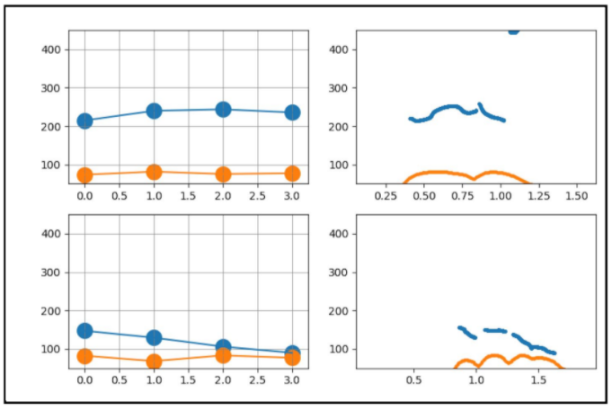
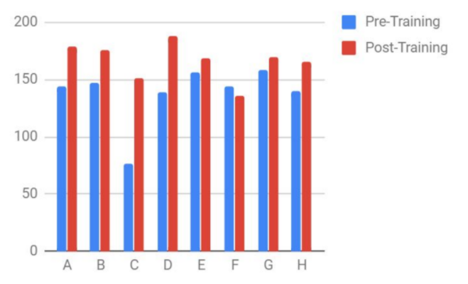

# Japanese Prosody Trainer
An MVP for a prosody visualizer to help English speakers compare their speech prosody (voice pitch and intensity) to that of a native speaker.

Built with Tkinter, praatio, pyJuliusAlign, pyaudio, matplotlib.

 

Left column: user-friendly prosody visualization at syllable level (orange = intensity, blue = pitch). Right column: original prosody data.
Top: native speaker's prosody. Bottom: English speaker's prosody.

#Reflection and interesting findings

This was a proof of concept that I built from scratch as part of my indepedent research project "Computer-Assisted Pronunciation Training in Japanese Pitch Accent Using Visual Feedback" in summer 2018. My faculty sponsor was Ikue Shingu-sensei from the Japanese Language Program at Harvard University.

While pitch contributes to meaning of Japanese words and to the naturalness of speeches, English speakers are often unaware of the spread of pitch across different syllables, or they tend to use intensity to "raise" their pitch. It is difficult for learners to improve this aspect by themselves, yet classroom time is already packed with grammar and vocabulary lessons.

This MVP was developed so that learners have a self-training tool to improve their prosody: they can see how their pitch pattern is different from that of a native speaker, and see whether they are raising intensity instead of pitch.

For this project, I started out learning Python, built out the tool and other materials, recruited participants, and tested the MVP during just one summer. This has been a great inspiration for me to quickly acquire new knowledge to solve the problem at hand.

8 people participated in the qualitative evaluation sessions for the training scheme. Preceptors at the Japanese Language Department who had had more than 20 years teaching Japanese at US colleges evaluated the audio records of the participants' qualitatively and quantitatively. 85.7% of participants showed improvement in the pronunciation evaluation test after a short session.

Pronunciation scores of the participants before and after the training (blue and red respectively).

